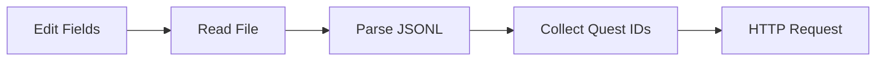

# Plan: Story-writer med step-templates og story-beat-writer

## Nuværende n8n-flow (reference)

Pipeline i [n8n/workflows/journalAddon.json](n8n/workflows/journalAddon.json):



- **Edit Fields**: config (path_to_sessions, realm, character_name, session).
- **Read File**: læser `{path}/{realm}/{character}/session-{session}/session-{session}.jsonl` (binær/tekst).
- **Parse JSONL**: split på newline, JSON.parse per linje → array af events.
- **Collect Quest IDs**: fra events med `type === 'quest'` og `action === 'accepted' | 'turned_in'` → unikke questID.
- **HTTP Request**: GET `https://www.wowhead.com/tbc/quest={questID}` per ID (n8n kører én eksekvering per item).

I JS gør vi “fetch + parse” som én step der tager et array af questIDs og returnerer et array af parsed quests, så pipelinen forbliver lineær uden loop-logik i runneren.

---

## Målstruktur

```
story-writer/
  package.json
  steps/
    index.js           # run(steps, input) + export af alle steps
    read-file.js
    parse-jsonl.js
    collect-quest-ids.js
    fetch-wowhead-quests.js   # for hver questID: GET + parseQuestHtml
    parse-wowhead-html.js     # ren parser (bruges af fetch-wowhead-quests)
  workflows/
    story-beat-writer/
      index.js         # instans: run([readFile, parseJsonl, collectQuestIds, fetchWowheadQuests], config)
      config.js        # default config (path, realm, character, session)
      schemas/         # quest_context, session_event, wowhead (flyttet fra root)
      docs/            # wowhead-html-parsing.md (flyttet)
      examples/        # session-01.jsonl, wowhead HTML samples (flyttet)
```

---

## 1. Rod og step-signatur

- **Opret** [story-writer/package.json](story-writer/package.json): name, type module (eller CommonJS konsekvent), script `"story-beat-writer": "node workflows/story-beat-writer/index.js"`.
- **Step-signatur**: hver step eksporterer `run(input, params)`.
  - `input`: output fra forrige step (fx `read-file` returnerer `{ path, content }` eller `{ content }`).
  - `params`: workflow-specifikke parametre (fx path, baseUrl).
  - Return: input til næste step; ved fejl kastes `Error` eller returneres `{ error: string }` (afhængigt af jeres konvention).

---

## 2. Step-templates under `story-writer/steps/`

| Step | Input | Params | Output | Kilde |

|------|--------|--------|--------|--------|

| **read-file** | `{ path_to_sessions, realm, character_name, session }` | evt. overrides | `{ config, content }` (content = fil som string) | n8n Read File + Edit Fields slået sammen: path = `{path}/{realm}/{character}/session-{session}/session-{session}.jsonl` |

| **parse-jsonl** | `{ content }` | - | `{ events }` (array af parsed objekter) | n8n Parse JSONL |

| **collect-quest-ids** | `{ events }` | - | `{ questIds }` (array af unikke questID, string eller number) | n8n Collect Quest IDs |

| **fetch-wowhead-quests** | `{ questIds }` | `baseUrl` (default `https://www.wowhead.com/tbc/quest=`) | `{ quests }` (array af parsed quest-objekter fra parseQuestHtml) | n8n HTTP Request + parseQuestHtml: for hver ID GET baseUrl+ID, parse HTML med parseQuestHtml |

| **parse-wowhead-html** | - | - | (bruges kun inden i fetch-wowhead-quests) | Eksisterende [schemas/wowhead/parseQuestHtml.js](schemas/wowhead/parseQuestHtml.js) |

- **read-file**: bruge `fs.promises.readFile(path, 'utf8')`; path bygges fra config. Ved manglende config bruge params.
- **parse-jsonl**: `content.split('\n')`, trim, filtrer tomme, `JSON.parse` per linje, saml i `events`.
- **collect-quest-ids**: samme logik som n8n (type === 'quest', action in ['accepted','turned_in'], questID).
- **fetch-wowhead-quests**: async step; `fetch` eller `https.get` per questID, concat body til string, kald parseQuestHtml (fra parse-wowhead-html.js), returnér `{ quests: [ ... ] }`. Rate-limiting eller retries kan tilføjes senere.
- **parse-wowhead-html**: flyt [schemas/wowhead/parseQuestHtml.js](schemas/wowhead/parseQuestHtml.js) til [story-writer/steps/parse-wowhead-html.js](story-writer/steps/parse-wowhead-html.js) og eksporter `parseQuestHtml`; ingen `run()` – kun brugt af fetch-wowhead-quests. Original slettes når hele schemas/wowhead/ fjernes (se §5).

---

## 3. Runner i `steps/index.js`

- **run(steps, initialInput)**:
  - `steps`: array af `{ step, params }` (step = modul med `run(input, params)`).
  - Start med `current = initialInput`.
  - For hver `{ step, params }`: `current = await step.run(current, params)` (eller `step.run(current, params)` hvis synkron).
  - Returnér sidste `current`.
- Eksporter alle step-moduler (readFile, parseJsonl, collectQuestIds, fetchWowheadQuests, parseQuestHtml) så workflow kan importere `require('../steps')` eller `import { run, readFile, ... } from '../steps/index.js'`.

---

## 4. Workflow story-beat-writer

- **config**: [story-writer/workflows/story-beat-writer/config.js](story-writer/workflows/story-beat-writer/config.js) med default `path_to_sessions`, `realm`, `character_name`, `session` (samme felter som n8n Edit Fields).
- **index.js**: 
  - Læs config (fra config.js + evt. CLI/env overrides).
  - Definer pipeline: `[ { step: readFile, params: config }, { step: parseJsonl }, { step: collectQuestIds }, { step: fetchWowheadQuests, params: { baseUrl: '...' } } ]`.
  - Kald `run(pipeline, initialInput)` hvor `initialInput` er tom eller kun config-felter (så read-file får path-felter).
  - Skriv resultat til stdout (JSON) eller gem til fil (valgfrit, kan nævnes som “evt. output-fil”).

---

## 5. Flytning af docs, schemas og eksempler

Alt hører til story-writer; **flyt** (ikke kopier) så der kun er én kilde og ingen duplikater:

- [docs/wowhead-html-parsing.md](docs/wowhead-html-parsing.md) → [story-writer/workflows/story-beat-writer/docs/wowhead-html-parsing.md](story-writer/workflows/story-beat-writer/docs/wowhead-html-parsing.md). **Slet** originalen i `docs/`.
- [schemas/quest_context.schema.json](schemas/quest_context.schema.json) og [schemas/session_event.schema.json](schemas/session_event.schema.json) → [story-writer/workflows/story-beat-writer/schemas/](story-writer/workflows/story-beat-writer/schemas/). **Slet** originalerne i `schemas/`.
- [schemas/wowhead/http_get_examples/*.html](schemas/wowhead/http_get_examples/) → [story-writer/workflows/story-beat-writer/examples/wowhead/](story-writer/workflows/story-beat-writer/examples/wowhead/). **Slet** mappen [schemas/wowhead/](schemas/wowhead/) (inkl. parseQuestHtml.js, som nu ligger i story-writer/steps/parse-wowhead-html.js).
- [docs/dummy-data/session-01.jsonl](docs/dummy-data/session-01.jsonl) (evt. også session-02) → [story-writer/workflows/story-beat-writer/examples/](story-writer/workflows/story-beat-writer/examples/). **Slet** eller behold `docs/dummy-data/` efter behov (hvis andre docs refererer til dummy-data, behold mappen og fjern kun de filer der er flyttet).

Efter flytning: ingen duplicates; alle referencer i repo (README, andre docs) opdateres til de nye stier under `story-writer/`.

---

## 6. Afhængigheder og kørsel

- Ingen eksterne dependencies på nuværende tidspunkt (Node built-in `fs`, `https`/`fetch`). `package.json` kan være minimal (name, scripts).
- Kør: `node story-writer/workflows/story-beat-writer/index.js` eller `npm run story-beat-writer` fra repo root (hvis script er tilføjet i root) / fra `story-writer/`.

---

## 7. Rækkefølge af implementering

1. Opret `story-writer/` og `story-writer/package.json`.
2. Opret `story-writer/steps/parse-wowhead-html.js` (kopi af parseQuestHtml.js, kun export).
3. Opret `story-writer/steps/read-file.js`, `parse-jsonl.js`, `collect-quest-ids.js`, `fetch-wowhead-quests.js`.
4. Opret `story-writer/steps/index.js` (run + re-export af steps).
5. Opret `story-writer/workflows/story-beat-writer/config.js` og `index.js`.
6. Flyt docs, schemas og examples til story-beat-writer; slet originaler i root (ingen duplicates).
7. Opdater evt. referencer i repo (README, andre docs) til nye stier.
8. Test med examples/session-01.jsonl og evt. en kendt questID.

---

## Kort oversigt

- **Steps** = genbrugelige templates (read-file, parse-jsonl, collect-quest-ids, fetch-wowhead-quests; parse-wowhead-html er hjælpefunktion).
- **Workflow** = instans af templates med config og rækkefølge i story-beat-writer.
- **Runner** = `run(steps, initialInput)` i steps/index.js.
- Ingen n8n-afhængighed; alt kører med Node i repo.